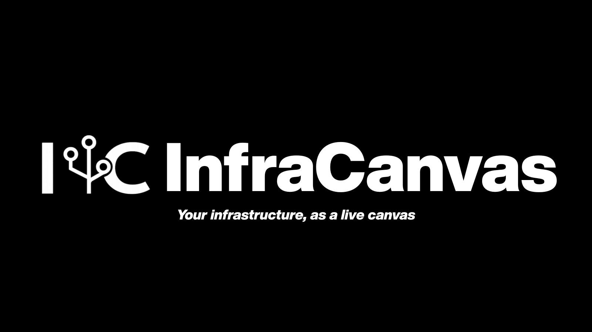

<p align="center">
  
</p>

<p align="center">
  <a href="https://github.com/bytestrix/InfraCanvas/releases/latest"></a>
  <a href="https://github.com/bytestrix/InfraCanvas/actions/workflows/ci.yml"></a>
  <a href="LICENSE"></a>
</p>

<p align="center">
  <a href="https://infracanvas.app">Website</a> ·
  <a href="https://demo.infracanvas.app/?token=demo"><strong>Live demo</strong></a> ·
  <a href="#-quick-start">Quick start</a> ·
  <a href="#-can-i-trust-this-on-my-vm">Trust</a> ·
  <a href="#-multiple-vms--one-dashboard">Multiple VMs</a> ·
  <a href="#-features">Features</a> ·
  <a href="#-how-it-works">How it works</a> ·
  <a href="#-security-model">Security</a> ·
  <a href="CONTRIBUTING.md">Contributing</a>
</p>

---

## What is it?

You SSH into a server and start piecing things together — `docker ps`, `kubectl get pods`, `ss -tlnp`, `systemctl list-units`, `df -h`... ten commands later you still have no real picture of **what's running and how it all connects**.

InfraCanvas replaces that ritual with one binary you run yourself. It automatically discovers every container, pod, service, volume and network on the host — plus systemd services and processes on plain VMs — and serves a **live, interactive topology map** in your browser. Nodes are green when healthy, red when not. You can open a terminal inside any container, tail logs, restart a service, or scale a deployment, all without leaving the page. Point it at [several VMs](#-multiple-vms--one-dashboard) and they all land in one dashboard.

You get a **map**, not a list: what runs where, what talks to what, and what's broken, at a glance. Self-hosted end to end — your infrastructure data never leaves your machines.

---

## 🚀 Quick start

Everything runs on **your** machine — discovery, relay, and dashboard are one process, one binary. Nothing is sent to us; there is no backend, no account, no telemetry ([details](#-can-i-trust-this-on-my-vm)). Pick the path that matches how you like to run software:

### Option A — Build from source, keep it fully private

You compile it, you read it, nothing enters your VM that you didn't build. Requires Go 1.21+ and Node 20+:

```bash
git clone https://github.com/bytestrix/InfraCanvas.git
cd InfraCanvas && make all

./bin/infracanvas serve --no-tunnel --private
# → http://localhost:7777/?token=…
```

Reach it from your laptop over SSH (`ssh -L 7777:127.0.0.1:7777 user@vm`), open your own port with `--no-tunnel`, or put [Nginx or Caddy in front](#-self-hosting-without-cloudflare) with your own domain and TLS. Your network rules, your call.

### Option B — Release binary, your own network rules

Grab a prebuilt binary from [Releases](https://github.com/bytestrix/InfraCanvas/releases/latest), make it executable, run it the same way:

```bash
curl -fsSLO https://github.com/bytestrix/InfraCanvas/releases/latest/download/infracanvas-linux-amd64
chmod +x infracanvas-linux-amd64

./infracanvas-linux-amd64 serve --no-tunnel --private   # localhost only, SSH-tunnel in
./infracanvas-linux-amd64 serve --no-tunnel             # bind 0.0.0.0:7777, open the port yourself
```

No installer, no systemd, no firewall changes made on your behalf — just a static binary you can delete when done.

### Option C — One-command install (fastest way to try it)

If you'd rather have it running in 30 seconds — installer, systemd unit, and a free outbound-only [Cloudflare quick-tunnel](https://developers.cloudflare.com/cloudflare-one/connections/connect-networks/do-more-with-tunnels/trycloudflare/) URL included ([read the script first](install-agent.sh) — it's one file of plain bash):

```bash
curl -fsSL https://github.com/bytestrix/InfraCanvas/releases/latest/download/install.sh | bash
```

```
✓ InfraCanvas installed and running

  Open in your browser:
    https://shy-pine-2f1a.trycloudflare.com/?token=a8f3e2b1c9d4f02e

  Auth token:  a8f3e2b1c9d4f02e  (saved in /etc/infracanvas/config.env)
```

The tunnel is optional even here — every private-by-default flag works through the installer too:

<details>
<summary><strong>Install options</strong></summary>

```bash
# Skip Cloudflare tunnel; bind 0.0.0.0:7777 directly
curl -fsSL .../install.sh | bash -s -- --no-tunnel

# Bind 127.0.0.1 only; reach via SSH tunnel (implies --no-tunnel)
curl -fsSL .../install.sh | bash -s -- --private

# Custom port (default 7777) — only matters with --no-tunnel
curl -fsSL .../install.sh | bash -s -- --port 8888

# Read-only: viewers can look, not touch — public demos and dashboards on a TV
curl -fsSL .../install.sh | bash -s -- --read-only

# Agent-only: join this VM to an existing hub (see Multiple VMs below)
curl -fsSL .../install.sh | bash -s -- --join <hub-url> --token <join-token>

# Pin a specific version
curl -fsSL .../install.sh | bash -s -- --version v0.12.1
```

</details>

<details>
<summary><strong>Run on your laptop</strong></summary>

Build from source (Option A), then:

```bash
infracanvas serve
# → https://*.trycloudflare.com/?token=…   (or --no-tunnel for http://localhost:7777)
```

You'll see your laptop's Docker containers and Kubernetes context on the canvas.

</details>

---

## 🔐 Can I trust this on my VM?

You should ask that about anything you run on a production box. Here's the model, verifiable in this repo:

- **Your data never leaves your machines.** Discovery, the relay, and the dashboard all run in one process on your VM. There is no cloud backend, no account, no telemetry, no phone-home. The only outbound connection is the optional Cloudflare tunnel — and you can turn it off.
- **The tunnel is a convenience, not a requirement.** `--no-tunnel` binds a port you open yourself; `--private` binds `127.0.0.1` so the only way in is your own SSH. Zero third parties involved.
- **Everything is readable before you run it.** The [installer](install-agent.sh) is one file of plain bash. The whole product is AGPL-3.0 — build it from source in two commands and run exactly what you compiled.
- **Auth by default.** Every install generates a random token; without it every request gets `401`. Secrets in env vars are [redacted](#-security-model) before they ever reach the UI layer.
- **Runs as your user, not root**, with only the access you already have (docker group, your kubeconfig).

Full details in the [Security model](#-security-model) and [SECURITY.md](SECURITY.md).

---

## 💻 Multiple VMs — one dashboard

One VM runs the dashboard (the **hub**); every other VM streams to it over an **outbound-only** WebSocket — no ports opened, nothing installed beyond the agent.

```bash
# On the hub VM:
infracanvas serve      # prints a join token + ready-made join command

# On every other VM (copy the command serve printed):
curl -fsSL https://github.com/bytestrix/InfraCanvas/releases/latest/download/install.sh \
  | sudo bash -s -- --join <hub-url> --token <join-token>

# or, with the binary already there:
infracanvas start --backend <hub-url> --token <join-token>
```

Each machine appears in the sidebar's **Machines** list within seconds — click to switch between live canvases. Agents reconnect automatically and keep their identity across restarts.

Prefer fully isolated dashboards instead? Just install normally on each VM — every one gets its own URL.

---

## ✨ Features

### Live topology map
Every container, pod, service, volume and network drawn as connected nodes with edges showing what talks to what. Not a list — a map. Updates every 30 seconds, diff-only.

### Works on any VM — even without Docker or Kubernetes
Plain VMs running nginx, postgres, node via systemd or PM2 get real workload nodes on the canvas. Listening ports and established connections are mapped from `/proc/net/tcp` — so you get real `CONNECTS_TO` edges (e.g. `next-server → postgres :5432`) without any config.

### LXC / LXD / Incus
Containers managed by LXD or Incus are auto-discovered from the local socket and drawn on the canvas alongside Docker and Kubernetes — name, status, memory, and network, no config. (Discovery/visualization today; terminal & actions for LXC/LXD are on the roadmap.)

### Terminals, logs and actions — built in
- **Container terminal** — full interactive shell inside any container
- **VM shell** — host PTY, no SSH needed
- **Logs** — tail any container, pod, or systemd service with one click, color-coded
- **Actions** — restart, stop, start, scale, rolling-restart, update image, service start/stop, process kill — all from the node panel

### Health at a glance
Green / amber / red from real container state, pod phase, and zombie process detection. An alert banner appears automatically when something breaks.

### Inspect everything
Env vars (secrets auto-masked), port mappings, volume mounts, image details, service unit, main PID, restart count, established connections.

### Zero dependencies
One static Go binary with the dashboard embedded. Works with Docker, Kubernetes, plain systemd services, PM2 — none of them required.

### Many VMs, one canvas
Run the dashboard on one VM and join the rest as outbound-only agents — no inbound ports on the joined machines. Switch between them from the sidebar. See [Multiple VMs](#-multiple-vms--one-dashboard).

### Secure by default
Binds localhost. Tunnel is optional and outbound-only. Random per-install auth token, separate token for joining agents. Secret redaction before data leaves the discovery layer. Runs as your user, not root. Optional `--read-only` mode for public dashboards.

---

## ⚙️ How it works

```
       ┌─────────────────────────────────────────┐
       │  your-vm                                │
       │                                         │
       │   ┌────────────────────────────────┐    │
       │   │  infracanvas (single binary)   │    │
       │   │   ├── discovery agent          │    │
       │   │   ├── WebSocket relay          │    │
       │   │   └── embedded dashboard UI    │    │
       │   └────────────────────────────────┘    │
       │            ▲ 127.0.0.1:7777             │
       │            │                            │
       │   ┌────────┴───────┐                    │
       │   │  cloudflared   │  outbound only     │
       │   └────────┬───────┘                    │
       └────────────┼────────────────────────────┘
                    │  Cloudflare quick-tunnel
                    ▼
              ┌──────────┐
              │  browser │  →  https://xyz.trycloudflare.com
              └──────────┘
```

One binary, one URL. The dashboard, relay and agent all run in the same process on the machine you're inspecting. Your browser is just a client. The tunnel above is optional — with `--no-tunnel` or `--private` the diagram loses its `cloudflared` box entirely and nothing leaves your network.

Adding more VMs keeps the same shape: the hub's relay accepts extra agents, each connecting **outbound** to the hub.

```
   other-vm-1 ──┐  outbound WS
   other-vm-2 ──┤─────────────▶  hub-vm  ◀── browser
   other-vm-3 ──┘  (agent only)   (relay + dashboard)
```

Joined VMs open no inbound port and serve no UI — they only push their graph to the hub.

---

## 🌐 Self-hosting without Cloudflare

The default install uses a Cloudflare quick-tunnel for zero-config HTTPS. If you want to use your own domain and reverse proxy instead, pass `--no-tunnel`:

```bash
curl -fsSL https://github.com/bytestrix/InfraCanvas/releases/latest/download/install.sh | bash -s -- --no-tunnel
# Binds 0.0.0.0:7777 — no cloudflared process started
```

Then point your reverse proxy at `127.0.0.1:7777`.

<details>
<summary><strong>Nginx + Let's Encrypt</strong></summary>

```nginx
server {
    listen 80;
    server_name infra.yourdomain.com;
    return 301 https://$host$request_uri;
}

server {
    listen 443 ssl;
    server_name infra.yourdomain.com;

    ssl_certificate     /etc/letsencrypt/live/infra.yourdomain.com/fullchain.pem;
    ssl_certificate_key /etc/letsencrypt/live/infra.yourdomain.com/privkey.pem;

    location / {
        proxy_pass http://127.0.0.1:7777;
        proxy_http_version 1.1;
        proxy_set_header Upgrade $http_upgrade;
        proxy_set_header Connection "upgrade";
        proxy_set_header Host $host;
        proxy_read_timeout 300s;
    }
}
```

Get a cert: `sudo certbot --nginx -d infra.yourdomain.com`

</details>

<details>
<summary><strong>Caddy (auto-HTTPS, simplest option)</strong></summary>

```caddy
infra.yourdomain.com {
    reverse_proxy localhost:7777
}
```

Caddy handles TLS automatically. No certbot needed.

</details>

<details>
<summary><strong>SSH tunnel (no domain needed)</strong></summary>

Keep the server private (`--private` binds `127.0.0.1` only), then forward to your laptop:

```bash
# On your laptop:
ssh -L 7777:127.0.0.1:7777 user@your-server
# Open: http://localhost:7777/?token=<your-token>
```

No public exposure, no domain, no TLS setup.

</details>

---

## 🔒 Security model

**The exposed URL.** Default mode binds `127.0.0.1:7777` and exposes it through a Cloudflare quick-tunnel — outbound-only from your VM, HTTPS-terminated at Cloudflare's edge. Pass `--no-tunnel` to bind `0.0.0.0` directly, or `--private` to bind `127.0.0.1` only and reach it via SSH tunnel.

**The auth token.** Every install generates a random 24-character token saved to `/etc/infracanvas/config.env`. The dashboard requires it on first visit (`?token=…`); after that it's in an HTTP-only cookie. Without the token, every request returns `401`. Treat the URL+token like an SSH key for the box.

**Joining agents.** In hub mode the relay issues a separate join token; an agent that can't present it is rejected at the WebSocket handshake. Joined VMs connect outbound only — the hub never dials into them, so they need no open port.

**Read-only mode.** Pass `--read-only` to turn the dashboard into a viewer — the relay rejects every action and terminal request server-side. Topology and logs still work. Use this for public demos or a wall-mounted status screen.

**Secret redaction.** Env vars whose names contain `SECRET`, `TOKEN`, `KEY`, `PASSWORD`, `CREDENTIAL`, `AUTH`, or `PASSWD` are replaced with `[REDACTED]` before they leave the discovery layer.

**Runs as you, not root.** The systemd unit runs as `$SUDO_USER`. The agent inherits your `~/.kube/config` and docker group membership — no privilege escalation beyond what you already have.

See [SECURITY.md](SECURITY.md) for the vulnerability disclosure policy.

---

## 🔧 Managing the service

```bash
sudo systemctl status   infracanvas
sudo systemctl restart  infracanvas
sudo systemctl stop     infracanvas
sudo journalctl -u infracanvas -f
```

Config in `/etc/infracanvas/config.env`:

```bash
INFRACANVAS_UI_TOKEN=a8f3e2b1c9d4f02e
INFRACANVAS_PORT=7777
INFRACANVAS_TUNNEL=true
INFRACANVAS_PRIVATE=false
INFRACANVAS_READONLY=false
```

On a VM installed with `--join`, the same file instead holds the hub address and join token:

```bash
INFRACANVAS_BACKEND=https://hub.example.com
INFRACANVAS_TOKEN=<join-token>
```

Edit, then `sudo systemctl restart infracanvas`.

<details>
<summary><strong>Uninstall</strong></summary>

```bash
curl -fsSL https://github.com/bytestrix/InfraCanvas/releases/latest/download/uninstall.sh | sudo bash
```

Removes: binary, systemd unit, `/etc/infracanvas/`, and the cached `cloudflared` binary (~30 MB). Or run locally: `sudo ./uninstall-agent.sh`

</details>

---

## 🛠️ Building from source

**Requirements:** Go 1.21+, Node.js 20+

```bash
git clone https://github.com/bytestrix/InfraCanvas.git
cd InfraCanvas

make all                # build dashboard + binary (with embedded UI)
./bin/infracanvas serve # → http://localhost:7777/?token=…
```

<details>
<summary><strong>Make targets</strong></summary>

```bash
make build-frontend     # Next.js static export → pkg/webui/dist/
make build              # binary with embedded UI (requires dist/)
make build-stub         # binary with placeholder UI — fast, for backend iteration
make release            # cross-compile linux/darwin × amd64/arm64 → bin/release/
make test               # Go tests
make clean              # remove bin/ and embedded dashboard
```

</details>

<details>
<summary><strong>Project layout</strong></summary>

```
InfraCanvas/
├── cmd/infracanvas/cmd/
│   ├── serve.go              # `infracanvas serve` — boots relay + UI + agent
│   ├── start.go              # `infracanvas start` — agent-only mode
│   ├── discover.go           # one-shot CLI discovery
│   └── …
├── pkg/
│   ├── agent/                # WebSocket agent: discover, diff, exec, actions
│   ├── server/               # relay: WebSocket broker, sessions, auth, static UI
│   ├── webui/                # embedded dashboard (build-tagged)
│   ├── actions/              # Docker / K8s / Host action runners
│   ├── discovery/            # docker, host, kubernetes
│   ├── orchestrator/         # combines discovery sources into one snapshot
│   ├── output/               # graph builder
│   ├── relationships/        # edges between entities
│   ├── health/               # health status calculation
│   └── redactor/             # strips sensitive env vars
├── frontend/
│   ├── app/page.tsx          # dashboard shell, machine switcher, auto-connects local
│   ├── components/canvas/    # ReactFlow canvas, node detail panel, terminal, logs
│   ├── lib/wsManager.ts      # WS client
│   └── store/vmStore.ts      # Zustand state
├── install-agent.sh
└── uninstall-agent.sh
```

</details>

See [ARCHITECTURE.md](ARCHITECTURE.md) for a deeper dive.

---

## 🤝 Contributing

Contributions welcome. See [CONTRIBUTING.md](CONTRIBUTING.md). Open an issue before a large PR. `make test` and `make lint` must pass, plus `cd frontend && npm run lint`.

New here? Start with [`good first issue`](https://github.com/bytestrix/InfraCanvas/issues?q=is%3Aopen+label%3A%22good+first+issue%22).

---

## 📄 License

GNU Affero General Public License v3.0 — see [LICENSE](LICENSE).

- Free for any personal or internal company use
- Fork, modify, redistribute — keep changes open source
- If you run this as a paid cloud service for customers, your modifications must be open source too

---

## 🌟 Star History

<a href="https://www.star-history.com/?repos=bytestrix%2FInfracanvas&type=date&legend=top-left">
 <picture>
   <source media="(prefers-color-scheme: dark)" srcset="https://api.star-history.com/chart?repos=bytestrix/Infracanvas&type=date&theme=dark&legend=top-left&sealed_token=ukX_-O1xGLdCErEoXqj8P_2UdC2-7qiEbwH5xUqDjSXPhTWuMHSJs0jMVSX8fU1RV2nEZgZ3LjEr1N-WidHtwLhkVGBc6Evm5t5ZXWT1BW3fbP3tzYcuWQ" />
   <source media="(prefers-color-scheme: light)" srcset="https://api.star-history.com/chart?repos=bytestrix/Infracanvas&type=date&legend=top-left&sealed_token=ukX_-O1xGLdCErEoXqj8P_2UdC2-7qiEbwH5xUqDjSXPhTWuMHSJs0jMVSX8fU1RV2nEZgZ3LjEr1N-WidHtwLhkVGBc6Evm5t5ZXWT1BW3fbP3tzYcuWQ" />
   
 </picture>
</a>

<p align="center">
  Built by <a href="https://bytestrix.com">Bytestrix</a>
</p>
