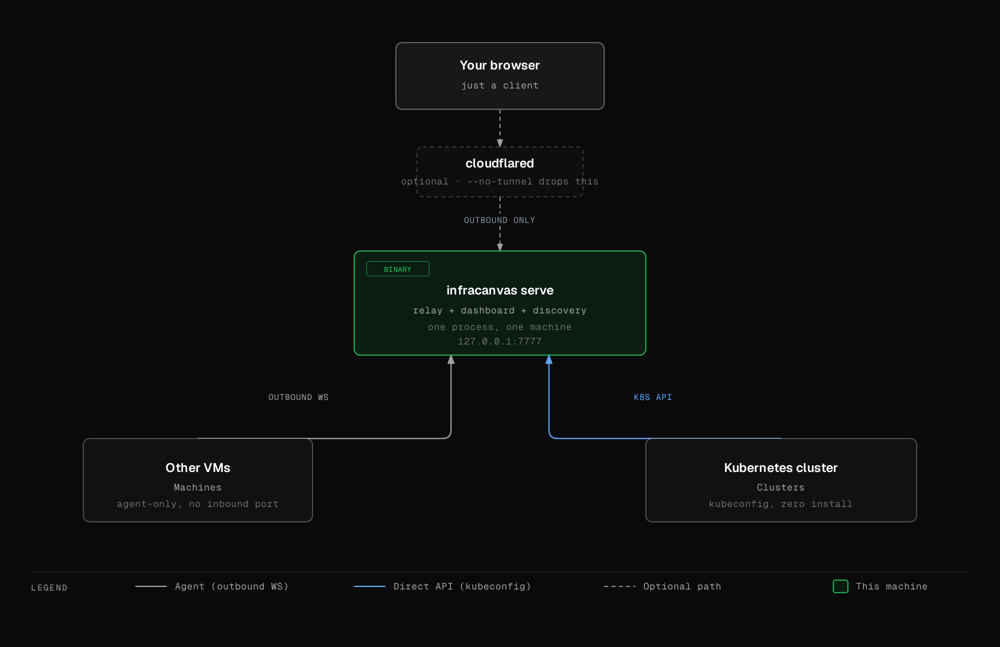

<h1 align="center">InfraCanvas</h1>

<p align="center">
  <b>A live map of everything running on your servers: containers, pods, services, volumes, networks and plain processes, with a terminal one click away.</b>
</p>

<p align="center">
  <a href="https://github.com/bytestrix/InfraCanvas/releases/latest"></a>
  <a href="https://github.com/bytestrix/InfraCanvas/actions/workflows/ci.yml"></a>
  <a href="LICENSE"></a>
</p>

<p align="center">
  <a href="https://demo.infracanvas.app/?token=demo"><strong>Live demo</strong></a> ·
  <a href="#quick-start">Quick start</a> ·
  <a href="docs/install.md">Install options</a> ·
  <a href="docs/security.md">Security</a> ·
  <a href="https://infracanvas.app">Website</a>
</p>

<p align="center">
  <a href="https://demo.infracanvas.app/?token=demo"></a>
</p>

You SSH into a box and run `docker ps`, `kubectl get pods`, `ss -tlnp`, `systemctl list-units`, `df -h`, and you still have to piece together what talks to what. InfraCanvas is one Go binary that does that discovery for you and draws it as a graph in your browser. It refreshes every 30 seconds. From any node you can open a shell, tail logs, restart, scale or kill.

It runs on your machine. The self-hosted binary has no account, no telemetry and no InfraCanvas backend.

## Quick start

**On your laptop or any machine, localhost only:**

```bash
os=$(uname -s | tr '[:upper:]' '[:lower:]'); arch=$(uname -m)
[ "$arch" = x86_64 ] && arch=amd64; [ "$arch" = aarch64 ] && arch=arm64
curl -fsSLo infracanvas "https://github.com/bytestrix/InfraCanvas/releases/latest/download/infracanvas-$os-$arch"
chmod +x infracanvas && ./infracanvas serve --no-tunnel --private
```

Open the `http://localhost:7777/?token=…` URL it prints. It finds Docker, Podman and your current kubeconfig context on its own.

**With Docker:**

```bash
docker run -d --name infracanvas --pid=host --network=host \
  -v /var/run/docker.sock:/var/run/docker.sock -v infracanvas:/data \
  ghcr.io/bytestrix/infracanvas:latest serve --no-tunnel --private
docker logs infracanvas   # prints the URL
```

**On a Linux VM, as a systemd service:**

```bash
curl -fsSL https://github.com/bytestrix/InfraCanvas/releases/latest/download/install.sh | bash -s -- --private
```

Leave off `--private` and the installer opens a Cloudflare quick-tunnel and prints a public HTTPS URL. That's handy, but it puts a dashboard with terminal access on the internet behind a token, so read [the install guide](docs/install.md#on-a-linux-vm-with-the-installer) first.

## What it shows

| Source | What you get |
|---|---|
| **Docker / Podman** | containers, images, volumes, networks, port mappings, env (secrets masked) |
| **Kubernetes** | nodes, namespaces, deployments, statefulsets, daemonsets, jobs, pods, services, ingresses, PVCs, events |
| **LXD / Incus** | containers with status, memory and network |
| **Plain VMs** | systemd services, PM2 apps and listening processes, with `CONNECTS_TO` edges built from `/proc/net/tcp` (e.g. `next-server → postgres :5432`) |

Nodes are green, amber or red from real state: container status and health checks, pod phase, ready replicas, zombie processes, and host CPU, memory and disk thresholds. The canvas starts at the host; click a group to drill into it, so a cluster with hundreds of pods doesn't land on screen all at once.

**From any node:** shell into a container, pod or the host; tail logs from containers, pods or systemd units; restart, stop, start, scale, rolling-restart, change an image, or kill a process. `--read-only` turns all of that off for demos and status screens.

**More than one machine:** other VMs join a hub with an outbound-only agent, and Kubernetes clusters connect by dropping in a kubeconfig, with nothing installed in the cluster. See [Multiple machines and clusters](docs/multi-machine.md).

## How it compares

| Tool | Covers | View |
|---|---|---|
| **InfraCanvas** | Docker, Podman, Kubernetes, LXD/Incus, systemd, PM2, processes | one graph across all of them |
| Weave Scope | Docker, Kubernetes, processes | graph; no longer maintained |
| Portainer | Docker, Kubernetes | lists and forms |
| Lens, Headlamp, k9s | Kubernetes | Kubernetes resources only |

If you used Weave Scope, this covers the same ground and adds LXD, systemd and PM2.

## How it works

<p align="center"></p>

`infracanvas serve` runs discovery, a WebSocket relay and the embedded Next.js dashboard in one process. Each discovery pass builds a graph, and the agent sends only the diff to the browser. Joined VMs run `infracanvas start` and push their own graph to the hub. Details in [ARCHITECTURE.md](ARCHITECTURE.md).

## Security, in short

- A random 24-character token is required for every request; without it you get `401`.
- Env vars and command-line flags that look like secrets are masked before they reach the UI.
- Every action and terminal session is written to a local audit log.
- The systemd service runs as the user who ran the installer, not root, unless you install from a root shell.

Full model, including what the tunnel exposes: [docs/security.md](docs/security.md). Vulnerability reports: [SECURITY.md](SECURITY.md).

## Hosted version

[InfraCanvas Cloud](https://cloud.infracanvas.app) runs the hub for you. The first 3 VMs are free. The open-source binary above is the full product and doesn't need it.

## Contributing

See [CONTRIBUTING.md](CONTRIBUTING.md). Issues labelled [`good first issue`](https://github.com/bytestrix/InfraCanvas/issues?q=is%3Aopen+label%3A%22good+first+issue%22) are scoped for a first PR. Build with `make all` (Go 1.25+, Node.js 20+); `make test`, `make lint` and `cd frontend && npm run lint` must pass.

## License

[AGPL-3.0](LICENSE). Free to use inside your company and to modify. If you distribute it, or run a modified version as a service for others, you have to publish your changes.

<a href="https://github.com/bytestrix/InfraCanvas/graphs/contributors">
  
</a>
