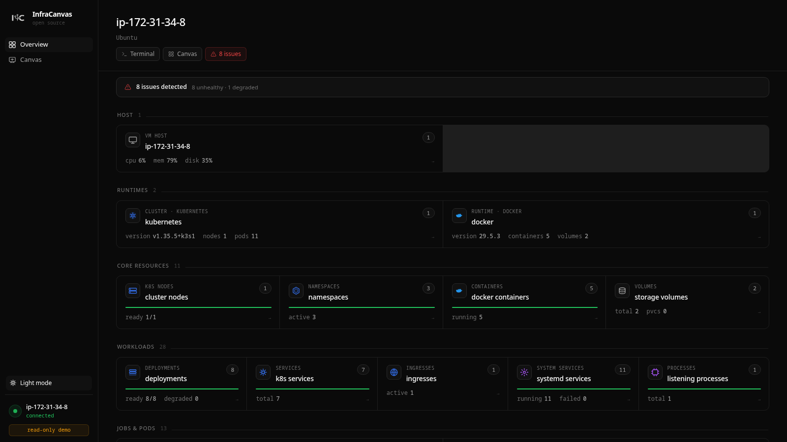

<p align="center">
  
</p>

<h1 align="center">InfraCanvas</h1>

<p align="center">
  <strong>Your infrastructure, as a live map.</strong><br/>
  One binary. Runs on any Linux VM. Open a URL, see everything.
</p>

<p align="center">
  <a href="https://github.com/bytestrix/InfraCanvas/releases/latest"></a>
  <a href="https://github.com/bytestrix/InfraCanvas/actions/workflows/ci.yml"></a>
  <a href="LICENSE"></a>
</p>

<p align="center">
  <a href="https://infracanvas.app">Website</a> ·
  <a href="https://demo.infracanvas.app/?token=demo"><strong>Live demo</strong></a> ·
  <a href="#-quick-start">Quick start</a> ·
  <a href="#-features">Features</a> ·
  <a href="#-how-it-works">How it works</a> ·
  <a href="#-security-model">Security</a> ·
  <a href="CONTRIBUTING.md">Contributing</a>
</p>

---

<p align="center">
  
</p>

---

## What is it?

You SSH into a server and start piecing things together — `docker ps`, `kubectl get pods`, `ss -tlnp`, `systemctl list-units`, `df -h`... ten commands later you still have no real picture of **what's running and how it all connects**.

InfraCanvas replaces that ritual with one command. It automatically discovers every container, pod, service, volume and network on the host — plus systemd services and processes on plain VMs — and serves a **live, interactive topology map** in your browser. Nodes are green when healthy, red when not. You can open a terminal inside any container, tail logs, restart a service, or scale a deployment, all without leaving the page.

It is not another list. It is a **map** — what runs where, what talks to what, and what's broken — in one glance.

<p align="center">
  
</p>

---

## 🚀 Quick start

On any Linux VM (cloud or bare metal):

```bash
curl -fsSL https://github.com/bytestrix/InfraCanvas/releases/latest/download/install.sh | bash
```

In under 30 seconds:

```
✓ InfraCanvas installed and running

  Open in your browser:
    https://shy-pine-2f1a.trycloudflare.com/?token=a8f3e2b1c9d4f02e

  Auth token:  a8f3e2b1c9d4f02e  (saved in /etc/infracanvas/config.env)
```

Open the URL — your infrastructure is live on the canvas. **No Docker required. No firewall changes. No signup. No config files.**

The URL is a free [Cloudflare quick-tunnel](https://developers.cloudflare.com/cloudflare-one/connections/connect-networks/do-more-with-tunnels/trycloudflare/) — outbound-only, works from anywhere, no inbound port needed.

<details>
<summary><strong>Install options</strong></summary>

```bash
# Custom port (default 7777) — only matters with --no-tunnel
curl -fsSL .../install.sh | bash -s -- --port 8888

# Skip Cloudflare tunnel; bind 0.0.0.0:7777 directly
curl -fsSL .../install.sh | bash -s -- --no-tunnel

# Bind 127.0.0.1 only; reach via SSH tunnel (implies --no-tunnel)
curl -fsSL .../install.sh | bash -s -- --private

# Read-only: viewers can look, not touch — public demos and dashboards on a TV
curl -fsSL .../install.sh | bash -s -- --read-only

# Pin a specific version
curl -fsSL .../install.sh | bash -s -- --version v0.12.1
```

</details>

<details>
<summary><strong>Multiple VMs</strong></summary>

Each VM is independent. Install on each one, open the printed URL for each in a separate tab. The binary is intentionally one-VM-per-dashboard.

</details>

<details>
<summary><strong>Run on your laptop</strong></summary>

Build from source (see [Building from source](#-building-from-source)), then:

```bash
infracanvas serve
# → https://*.trycloudflare.com/?token=…   (or --no-tunnel for http://localhost:7777)
```

You'll see your laptop's Docker containers and Kubernetes context on the canvas.

</details>

---

## ✨ Features

### Live topology map
Every container, pod, service, volume and network drawn as connected nodes with edges showing what talks to what. Not a list — a map. Updates every 30 seconds, diff-only.

### Works on any VM — even without Docker or Kubernetes
Plain VMs running nginx, postgres, node via systemd or PM2 get real workload nodes on the canvas. Listening ports and established connections are mapped from `/proc/net/tcp` — so you get real `CONNECTS_TO` edges (e.g. `next-server → postgres :5432`) without any config.

### Terminals, logs and actions — built in
- **Container terminal** — full interactive shell inside any container
- **VM shell** — host PTY, no SSH needed
- **Logs** — tail any container, pod, or systemd service with one click, color-coded
- **Actions** — restart, stop, start, scale, rolling-restart, update image, service start/stop, process kill — all from the node panel

### Health at a glance
Green / amber / red from real container state, pod phase, and zombie process detection. An alert banner appears automatically when something breaks.

### Inspect everything
Env vars (secrets auto-masked), port mappings, volume mounts, image details, service unit, main PID, restart count, established connections.

### Zero dependencies
One static Go binary with the dashboard embedded. Works with Docker, Kubernetes, plain systemd services, PM2 — none of them required.

### Secure by default
Binds localhost. Outbound-only Cloudflare tunnel. Random per-install auth token. Secret redaction before data leaves the discovery layer. Runs as your user, not root. Optional `--read-only` mode for public dashboards.

---

## ⚙️ How it works

```
       ┌─────────────────────────────────────────┐
       │  your-vm                                │
       │                                         │
       │   ┌────────────────────────────────┐    │
       │   │  infracanvas (single binary)   │    │
       │   │   ├── discovery agent          │    │
       │   │   ├── WebSocket relay          │    │
       │   │   └── embedded dashboard UI    │    │
       │   └────────────────────────────────┘    │
       │            ▲ 127.0.0.1:7777             │
       │            │                            │
       │   ┌────────┴───────┐                    │
       │   │  cloudflared   │  outbound only     │
       │   └────────┬───────┘                    │
       └────────────┼────────────────────────────┘
                    │  Cloudflare quick-tunnel
                    ▼
              ┌──────────┐
              │  browser │  →  https://xyz.trycloudflare.com
              └──────────┘
```

One binary, one URL. The dashboard, relay and agent all run in the same process on the machine you're inspecting. A bundled `cloudflared` opens an outbound-only tunnel so you get a public HTTPS URL with no inbound firewall rule. Your browser is just a client.

---

## 🔒 Security model

**The exposed URL.** Default mode binds `127.0.0.1:7777` and exposes it through a Cloudflare quick-tunnel — outbound-only from your VM, HTTPS-terminated at Cloudflare's edge. Pass `--no-tunnel` to bind `0.0.0.0` directly, or `--private` to bind `127.0.0.1` only and reach it via SSH tunnel.

**The auth token.** Every install generates a random 24-character token saved to `/etc/infracanvas/config.env`. The dashboard requires it on first visit (`?token=…`); after that it's in an HTTP-only cookie. Without the token, every request returns `401`. Treat the URL+token like an SSH key for the box.

**Read-only mode.** Pass `--read-only` to turn the dashboard into a viewer — the relay rejects every action and terminal request server-side. Topology and logs still work. Use this for public demos or a wall-mounted status screen.

**Secret redaction.** Env vars whose names contain `SECRET`, `TOKEN`, `KEY`, `PASSWORD`, `CREDENTIAL`, `AUTH`, or `PASSWD` are replaced with `[REDACTED]` before they leave the discovery layer.

**Runs as you, not root.** The systemd unit runs as `$SUDO_USER`. The agent inherits your `~/.kube/config` and docker group membership — no privilege escalation beyond what you already have.

See [SECURITY.md](SECURITY.md) for the vulnerability disclosure policy.

---

## 🔧 Managing the service

```bash
sudo systemctl status   infracanvas
sudo systemctl restart  infracanvas
sudo systemctl stop     infracanvas
sudo journalctl -u infracanvas -f
```

Config in `/etc/infracanvas/config.env`:

```bash
INFRACANVAS_UI_TOKEN=a8f3e2b1c9d4f02e
INFRACANVAS_PORT=7777
INFRACANVAS_TUNNEL=true
INFRACANVAS_PRIVATE=false
INFRACANVAS_READONLY=false
```

Edit, then `sudo systemctl restart infracanvas`.

<details>
<summary><strong>Uninstall</strong></summary>

```bash
curl -fsSL https://github.com/bytestrix/InfraCanvas/releases/latest/download/uninstall.sh | sudo bash
```

Removes: binary, systemd unit, `/etc/infracanvas/`, and the cached `cloudflared` binary (~30 MB). Or run locally: `sudo ./uninstall-agent.sh`

</details>

---

## 🛠️ Building from source

**Requirements:** Go 1.21+, Node.js 20+

```bash
git clone https://github.com/bytestrix/InfraCanvas.git
cd InfraCanvas

make all                # build dashboard + binary (with embedded UI)
./bin/infracanvas serve # → http://localhost:7777/?token=…
```

<details>
<summary><strong>Make targets</strong></summary>

```bash
make build-frontend     # Next.js static export → pkg/webui/dist/
make build              # binary with embedded UI (requires dist/)
make build-stub         # binary with placeholder UI — fast, for backend iteration
make release            # cross-compile linux/darwin × amd64/arm64 → bin/release/
make test               # Go tests
make clean              # remove bin/ and embedded dashboard
```

</details>

<details>
<summary><strong>Project layout</strong></summary>

```
InfraCanvas/
├── cmd/infracanvas/cmd/
│   ├── serve.go              # `infracanvas serve` — boots relay + UI + agent
│   ├── start.go              # `infracanvas start` — agent-only mode
│   ├── discover.go           # one-shot CLI discovery
│   └── …
├── pkg/
│   ├── agent/                # WebSocket agent: discover, diff, exec, actions
│   ├── server/               # relay: WebSocket broker, sessions, auth, static UI
│   ├── webui/                # embedded dashboard (build-tagged)
│   ├── actions/              # Docker / K8s / Host action runners
│   ├── discovery/            # docker, host, kubernetes
│   ├── orchestrator/         # combines discovery sources into one snapshot
│   ├── output/               # graph builder
│   ├── relationships/        # edges between entities
│   ├── health/               # health status calculation
│   └── redactor/             # strips sensitive env vars
├── frontend/
│   ├── app/page.tsx          # single-VM dashboard, auto-connects on mount
│   ├── components/canvas/    # ReactFlow canvas, node detail panel, terminal, logs
│   ├── lib/wsManager.ts      # WS client
│   └── store/vmStore.ts      # Zustand state
├── install-agent.sh
└── uninstall-agent.sh
```

</details>

See [ARCHITECTURE.md](ARCHITECTURE.md) for a deeper dive.

---

## 🤝 Contributing

Contributions welcome. See [CONTRIBUTING.md](CONTRIBUTING.md). Open an issue before a large PR. `make test` and `make lint` must pass, plus `cd frontend && npm run lint`.

New here? Start with [`good first issue`](https://github.com/bytestrix/InfraCanvas/issues?q=is%3Aopen+label%3A%22good+first+issue%22).

---

## 📄 License

GNU Affero General Public License v3.0 — see [LICENSE](LICENSE).

- Free for any personal or internal company use
- Fork, modify, redistribute — keep changes open source
- If you run this as a paid cloud service for customers, your modifications must be open source too

---

<p align="center">
  Built by <a href="https://bytestrix.com">Bytestrix</a>
</p>
