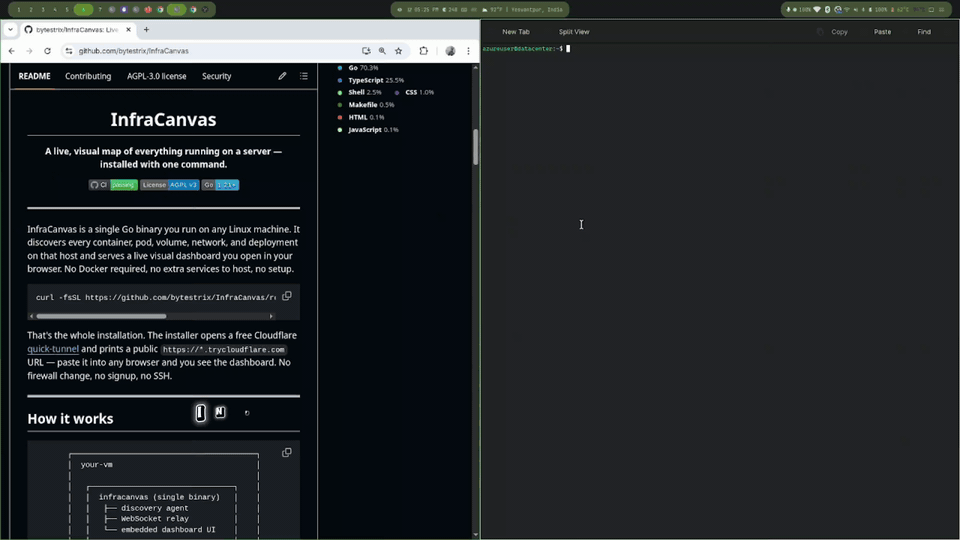
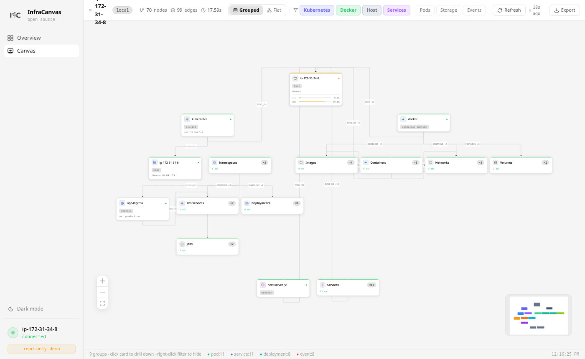

<p align="center">
  
</p>

<h1 align="center">InfraCanvas</h1>

<p align="center"><strong>See everything running on your server — as a live, visual map.</strong></p>

<p align="center">
  One command. One binary. Open a URL and watch your containers, pods, volumes and networks<br/>draw themselves as a connected graph — with terminals, logs and actions built in.
</p>

<p align="center">
  <a href="https://github.com/bytestrix/InfraCanvas/releases/latest"></a>
  <a href="https://github.com/bytestrix/InfraCanvas/actions/workflows/ci.yml"></a>
  <a href="https://goreportcard.com/report/github.com/bytestrix/InfraCanvas"></a>
  <a href="LICENSE"></a>
  <a href="https://github.com/bytestrix/InfraCanvas/stargazers"></a>
</p>

<p align="center">
  <a href="https://infracanvas.app">Website</a> ·
  <a href="#-quick-start">Quick start</a> ·
  <a href="#-features">Features</a> ·
  <a href="#-how-it-works">How it works</a> ·
  <a href="#-security-model">Security</a> ·
  <a href="CONTRIBUTING.md">Contributing</a>
</p>

<p align="center">
  
</p>

---

## Why InfraCanvas?

You SSH into a server and start piecing things together: `docker ps`, `kubectl get pods`, `ss -tlnp`, `df -h`... ten commands later you still have no real picture of **what's running and how it all connects**.

InfraCanvas replaces that ritual with a single command. It discovers every container, pod, service, volume and network on the host and renders them as a **live topology graph** in your browser — green when healthy, red when not, updated automatically.

```bash
curl -fsSL https://github.com/bytestrix/InfraCanvas/releases/latest/download/install.sh | bash
```

That's the entire installation. The installer prints a public HTTPS URL (via a free Cloudflare [quick-tunnel](https://developers.cloudflare.com/cloudflare-one/connections/connect-networks/do-more-with-tunnels/trycloudflare/)) — open it in any browser, from anywhere. **No Docker required, no firewall changes, no signup, no config files.**

> 🪶 Weave Scope walked so InfraCanvas could run — same live-topology idea, but actively maintained, a single static binary, and no per-host probes or app server to operate.

---

## ✨ Features

- 🗺️ **Live topology graph** — every container, pod, service, volume and network drawn as connected nodes. Not a list — a map.
- 🚦 **Health at a glance** — green / amber / red from real container and pod state, with an alert banner when something breaks.
- 💻 **Terminals in the browser** — open a shell inside any container, or on the host itself. No SSH session needed.
- 📜 **Logs without `docker logs`** — color-coded, downloadable, one click from the node.
- ⚡ **Act from the map** — restart, stop, scale, rolling-restart, update image — Docker and Kubernetes actions from the UI.
- 🔍 **Inspect everything** — env vars (secrets auto-masked), port mappings, volume mounts, image details.
- 🧩 **Zero dependencies** — one static Go binary with the dashboard embedded. Works with Docker, Kubernetes, or plain processes — none of them required.
- 🔒 **Secure by default** — binds localhost, outbound-only tunnel, token auth, secret redaction, optional read-only mode.
- 📤 **Export** — PNG screenshot or full JSON of the graph.

<p align="center">
  
  <br/>
  <em>The canvas: real-time CPU/memory per node, filters for Kubernetes / Docker / Host, grouped or flat layout.</em>
</p>

---

## 🚀 Quick start

On any Linux VM (cloud or bare metal):

```bash
ssh user@your-vm
curl -fsSL https://github.com/bytestrix/InfraCanvas/releases/latest/download/install.sh | bash
```

In under 30 seconds you'll see:

```
✓ InfraCanvas installed and running

  Open in your browser:
    https://shy-pine-2f1a.trycloudflare.com/?token=a8f3e2b1c9d4f02e

  This URL works from anywhere — Cloudflare's free quick-tunnel needs no
  firewall rule. The URL is ephemeral; it changes whenever the service
  restarts. Run with --no-tunnel for a stable URL on your own port.

  Auth token:  a8f3e2b1c9d4f02e  (saved in /etc/infracanvas/config.env)
```

Open the URL — your VM's infrastructure is live on the canvas.

<details>
<summary><strong>Install options</strong> (port, no-tunnel, private, read-only, version pinning)</summary>

```bash
# Custom port (default 7777) — only matters with --no-tunnel
curl -fsSL .../install.sh | bash -s -- --port 8888

# Skip Cloudflare tunnel; bind 0.0.0.0:7777 directly (open the port in your SG)
curl -fsSL .../install.sh | bash -s -- --no-tunnel

# Bind 127.0.0.1 only; reach via SSH tunnel (implies --no-tunnel)
curl -fsSL .../install.sh | bash -s -- --private

# Read-only: viewers can look but not touch (public demos, dashboards on a TV)
curl -fsSL .../install.sh | bash -s -- --read-only

# Pin a specific release
curl -fsSL .../install.sh | bash -s -- --version v0.4.0
```

</details>

<details>
<summary><strong>Multiple VMs</strong></summary>

Each VM is independent. Install on each, open the printed URL for each in a separate tab — no tunnel coordination needed. The binary is intentionally one-VM-per-dashboard.

</details>

<details>
<summary><strong>Run on your laptop</strong></summary>

The same binary works locally — build from source (see [Building from source](#-building-from-source)), then:

```bash
infracanvas serve
# → https://*.trycloudflare.com/?token=…   (or pass --no-tunnel for http://localhost:7777)
```

You'll see your laptop's Docker containers and Kubernetes context (if any) on the canvas. Useful for development and demos.

</details>

---

## ⚙️ How it works

```
       ┌─────────────────────────────────────────┐
       │  your-vm                                │
       │                                         │
       │   ┌────────────────────────────────┐    │
       │   │  infracanvas (single binary)   │    │
       │   │   ├── discovery agent          │    │
       │   │   ├── WebSocket relay          │    │
       │   │   └── embedded dashboard UI    │    │
       │   └────────────────────────────────┘    │
       │            ▲ 127.0.0.1:7777             │
       │            │                            │
       │   ┌────────┴───────┐                    │
       │   │  cloudflared   │  outbound only     │
       │   └────────┬───────┘                    │
       └────────────┼────────────────────────────┘
                    │  Cloudflare quick-tunnel
                    ▼
              ┌──────────┐
              │  laptop  │  →  https://xyz.trycloudflare.com
              └──────────┘
```

One binary, one URL. The dashboard, relay and agent all run in the same process on the machine you're inspecting. A bundled `cloudflared` opens an **outbound-only** tunnel to Cloudflare's edge, which gives you a public HTTPS URL with no inbound firewall rule. Your laptop is just a browser.

Prefer to expose the port directly? Pass `--no-tunnel` to bind `0.0.0.0:7777` (allow inbound TCP in your cloud security group). Add `--private` to bind `127.0.0.1` and reach the dashboard via SSH tunnel.

---

## 🥊 How is this different from Portainer, k9s, or Dozzle?

| Tool | What it's built for | What InfraCanvas does differently |
|---|---|---|
| **Portainer** | Full container *management* platform — users, teams, registries, stacks | InfraCanvas is a *map*, not a console. One binary, zero config, and it draws Docker, Kubernetes and the host as a single connected graph |
| **Lazydocker / k9s** | Excellent terminal UIs over SSH | Visual topology in any browser via a shareable URL — no SSH session, no terminal |
| **Dozzle** | Real-time container log viewer | Logs are one panel here; the core is the relationship graph — what runs where, and how it's all connected |
| **Weave Scope** | The original live topology map — archived and unmaintained | Same idea, actively developed, and a single static binary instead of per-host probes and an app server |

Short version: if you need deep fleet management, run Portainer. If you want to **see** a machine — every container, pod, volume and network, and how they connect — within 30 seconds of one command, that's InfraCanvas.

---

## 🔒 Security model

The dashboard, relay and agent all run on the same machine, so there's no remote agent ↔ relay channel to secure. The two surfaces that matter:

**1. The exposed URL.** Default mode binds `127.0.0.1:7777` and exposes it through a Cloudflare quick-tunnel — outbound-only from your VM, HTTPS-terminated at Cloudflare's edge. The URL is unguessable (random subdomain) but not secret — it's paired with the auth token below. With `--no-tunnel` the binary binds `0.0.0.0` directly. With `--private`, it binds `127.0.0.1` only and you reach it via SSH tunnel.

**2. The auth token.** Every install generates a random 24-character token (printed once, saved to `/etc/infracanvas/config.env`). The dashboard requires it on first visit (`?token=…`); after that it lives in an HTTP-only cookie. WebSocket calls also require the token. Without the token, every request returns `401`.

**What the dashboard can do once authenticated:** see the full topology, view logs, open a shell in any container or on the host, run Docker/Kubernetes actions. **Treat the URL+token like an SSH key for the box.**

**Read-only mode.** Pass `--read-only` (or `INFRACANVAS_READONLY=true`) to turn the dashboard into a viewer: the relay rejects every action and terminal request server-side. Topology and logs still work — use this for public demos or a wall-mounted status screen.

**Secret redaction.** Env vars whose names contain `SECRET`, `TOKEN`, `KEY`, `PASSWORD`, `CREDENTIAL`, `AUTH`, or `PASSWD` are replaced with `[REDACTED]` before they leave the discovery layer. File contents, database contents and network traffic are never touched.

**Runs as you, not root.** Installed via `sudo …/install.sh`, the systemd unit is written with `User=$SUDO_USER`. The agent inherits *your* `~/.kube/config` — Kubernetes discovery just works for whatever cluster you can already `kubectl` against. If you're in the `docker` group, `SupplementaryGroups=docker` is added so Docker discovery works without sudo. No privilege escalation beyond what you can already do at the shell.

See [SECURITY.md](SECURITY.md) for the vulnerability disclosure policy.

---

## 📋 All features

<details>
<summary><strong>Canvas</strong></summary>

| Feature | What it does |
|---|---|
| Live topology graph | Every container, pod, service, volume, network drawn as nodes with edges showing relationships |
| Real-time updates | Full snapshot on first connect, then only changes every 30s |
| Grouped view | Nodes grouped by type (Containers, K8s Workloads, Storage…) — one card per group, click to expand |
| Flat view | Every node laid out individually by type and relationship |
| Filter chips | Show/hide Kubernetes, Docker, Host, Pods, Storage, Events |
| Health colors | Green = healthy, amber = degraded, red = unhealthy |
| Alert banner | Appears automatically when any group has unhealthy nodes |
| Export PNG | Save the canvas as a high-res image |
| Export JSON | Download the raw graph (nodes, edges, metadata) |

</details>

<details>
<summary><strong>Containers & Docker</strong></summary>

| Feature | What it does |
|---|---|
| Container terminal | Full interactive shell inside any container |
| Container logs | Last 200 lines, color-coded, downloadable |
| Restart / Stop / Start | Run from the UI — executed by the in-process agent |
| Update image | Set a new image tag and the agent pulls and recreates |
| Environment variables | Shown with automatic secret masking |
| Port mappings | Host ↔ container port pairs |
| Volume mounts | Bind mounts and named volumes with paths |
| Image details | Registry, tag, size, digest, which containers use it |

</details>

<details>
<summary><strong>Kubernetes</strong></summary>

| Feature | What it does |
|---|---|
| Full resource graph | Cluster → Nodes → Namespaces → Deployments → Pods → Services → Ingress → PVCs |
| Health from pod phase | Running/Pending/Failed → green/amber/red |
| Rolling restart | `kubectl rollout restart` for Deployments, StatefulSets, DaemonSets |
| Update image | Change the image for any Deployment |
| Scale | Change replica count for Deployments and StatefulSets |
| Pod logs | Fetch logs from any pod |
| K8s events | Shown as nodes linked to the resources they affect |

</details>

<details>
<summary><strong>Host</strong></summary>

| Feature | What it does |
|---|---|
| VM terminal | Interactive shell on the host (not inside a container) |
| Host info | OS, kernel, CPU cores, memory, hostname |
| Cloud detection | Identifies AWS / GCP / Azure / on-prem |
| Environment detection | Infers prod/staging/dev from hostname patterns |

</details>

---

## 🔧 Managing the service

```bash
sudo systemctl status   infracanvas
sudo systemctl restart  infracanvas
sudo systemctl stop     infracanvas
sudo journalctl -u infracanvas -f
```

Config lives in `/etc/infracanvas/config.env`:

```bash
INFRACANVAS_UI_TOKEN=a8f3e2b1c9d4f02e
INFRACANVAS_PORT=7777
INFRACANVAS_TUNNEL=true
INFRACANVAS_PRIVATE=false
INFRACANVAS_READONLY=false
```

Edit, then `sudo systemctl restart infracanvas`.

<details>
<summary><strong>Uninstall</strong></summary>

```bash
curl -fsSL https://github.com/bytestrix/InfraCanvas/releases/latest/download/uninstall.sh | sudo bash
```

The uninstaller stops and disables the systemd service, then removes:

- `/usr/local/bin/infracanvas` — the binary
- `/etc/systemd/system/infracanvas.service` — the unit
- `/etc/infracanvas/` — config and auth token
- `~/.cache/infracanvas/` — the bundled `cloudflared` binary (~30 MB), for the user the service ran as

If you cloned this repo, you can also run it locally: `sudo ./uninstall-agent.sh`

</details>

---

## 🛠️ Building from source

**Requirements:** Go 1.21+, Node.js 20+

```bash
git clone https://github.com/bytestrix/InfraCanvas.git
cd InfraCanvas

make all                # build dashboard + binary (with embedded UI)
./bin/infracanvas       # → http://localhost:7777/?token=…
```

<details>
<summary><strong>Other make targets</strong></summary>

```bash
make build-frontend     # build the dashboard, embed under pkg/webui/dist/
make build              # build binary with embedded dashboard (requires dist/)
make build-stub         # build with placeholder UI — fastest, for backend iteration
make release            # cross-compile for linux/darwin × amd64/arm64
make test               # run all Go tests
make clean              # remove bin/ and embedded dashboard
```

</details>

<details>
<summary><strong>Project layout</strong></summary>

```
InfraCanvas/
├── cmd/infracanvas/cmd/
│   ├── serve.go              # `infracanvas serve` — boots relay + UI + agent
│   ├── start.go              # `infracanvas start` — agent-only mode
│   ├── discover.go           # one-shot CLI discovery
│   └── …
├── pkg/
│   ├── agent/                # WebSocket agent: discover, diff, exec, actions
│   ├── server/               # Relay: WebSocket broker, sessions, auth, static UI
│   ├── webui/                # Embedded dashboard (build-tagged)
│   ├── actions/              # Docker / K8s / Host action runners
│   ├── discovery/            # docker, host, kubernetes
│   ├── orchestrator/         # combines discovery sources into one snapshot
│   ├── output/               # graph builder
│   ├── relationships/        # edges between entities
│   ├── health/               # health status calculation
│   └── redactor/             # strips sensitive env vars
├── frontend/
│   ├── app/page.tsx          # single-VM dashboard, auto-connects on mount
│   ├── components/canvas/    # ReactFlow canvas, node detail panel, terminal, logs
│   ├── lib/wsManager.ts      # WS client, same-origin
│   └── store/vmStore.ts      # Zustand state
├── install-agent.sh          # one-command installer
└── uninstall-agent.sh
```

</details>

See [ARCHITECTURE.md](ARCHITECTURE.md) for a deeper dive.

---

## 🤝 Contributing

Contributions welcome! See [CONTRIBUTING.md](CONTRIBUTING.md). Open an issue before a large PR. `make test` and `make lint` must pass, plus `cd frontend && npm run lint`.

New here? Start with [`good first issue`](https://github.com/bytestrix/InfraCanvas/issues?q=is%3Aopen+label%3A%22good+first+issue%22).

---

## ⭐ Star history

If InfraCanvas saved you a few SSH sessions, **star the repo** — it's the main way other people find it.

[](https://star-history.com/#bytestrix/InfraCanvas&Date)

---

## 📄 License

GNU Affero General Public License v3.0 — see [LICENSE](LICENSE).

- ✅ Free for any personal or internal company use
- ✅ Fork, modify, redistribute — just keep changes open source
- ❌ If you run this as a paid cloud service for customers, your modifications must be open source too

This protects against large companies repackaging the project without contributing back. Individual developers and internal company use are unaffected.

---

<p align="center">
  Built by <a href="https://bytestrix.com">Bytestrix</a> — a product studio that ships software people actually need.
</p>
